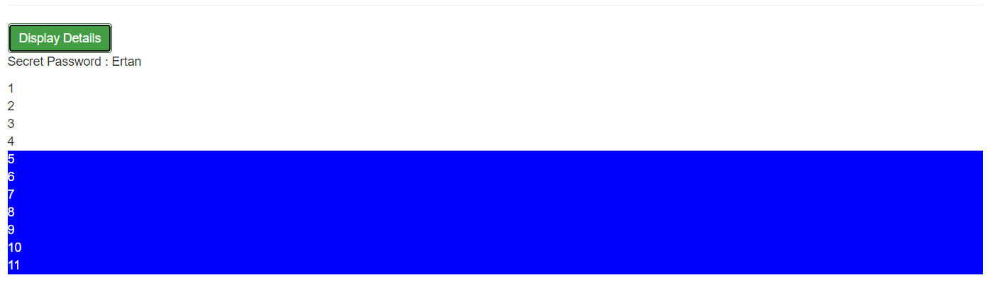

# Basic Assignment 1

> 1. Create two new Components (manually or with CLI): WarningAlert and SuccessAlert
> 2. Output them beneath each other in the AppComponent
> 3. Output a warning or success message in the Components
> 4. Style the Components appropriately (maybe some red/ green text?)
Use external or internal templates and styles!

Feel free to create more components, nest them into each other or play around with different types of selectors!

# Basic Assignment 2

> 1. Add an Input field which updates a property ('username') via Two-Way-Binding
> 2. Output the username property via String Interpolation (in a paragraph below the input)
> 3. Add a button which may only be clicked if the username is NOT an empty string
> 4. Upon clicking the button, the username should be reset to an empty string

# Basic Assignment 3

> 1. Add A button which says 'Display Details'
> 2. Add a paragraph with any content of your choice (e.g. 'Secret Password = tuna')
> 3. Toggle the displaying of that paragraph with the button created in the first step
> 4. Log all button clicks in an array and output that array below the secret paragraph (maybe log a timestamp or simply an incrementing number)
> 5. Starting at the 5th log item, give all future log items a blue background (via ngStyle) and white color (ngClass)

